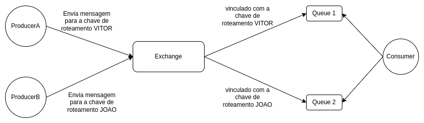
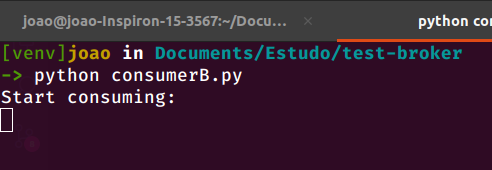
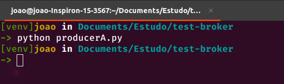
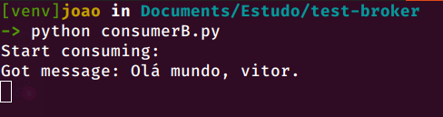

<div align="center">
  <h1>Kombu - Basic Produce and Consumer</h1>
</div>

----

## RabbitMQ 

O `RabbitMQ` é um agente de mensagens que permite ler e gravar mensagens 
em filas usando o (AMQP) `Advanced Message Queuing Protocol`.

> Saiba mais sobre o RabbitMQ em [link](https://www.rabbitmq.com/)

## Producer

O `producer` é a aplicação que envia uma mensagem para um serviço **RabbitMQ**.

## Consumer 

O `consumer` é a aplicação que lê mensagens.

## Exchange

A `exchange` é está dentro de um serviço **RabbitMQ**, e é responsável por fazer o roteamento das mensagens. Desse modo, um `producer` informará ao serviço **RabbitMQ** qual exchange deseja utilizar e a `exchange` descubrirá em qual fila colocar a mensagem.


## Exemplo



## Container do **RabbitMQ**

> Observação: É necessário ter o `docker` e o `docker-compose` instalado no seu computador.

🔗 Instalar docker-compose: [Link](https://docs.docker.com/compose/install/)

🔗 Instalar o docker: [Link](https://docs.docker.com/get-docker/)

> Na pasta raiz do projeto, onde está o arquivo `docker-compose.yml` execute o camando a baixo:

```
docker-compose up
```

> Esse comando acima subirar um container rodando o `RabbitMQ` no container.

## 1° Passo

> Vamos iniciar o nosso `consumer`, o qual está consumindo dados da Queue `example-queue`

```
python consumerB.py
```

> Você verá:



## 2° Passo

> Enviar uma mensagem para a `queue1`

```
python producerA.py
```

</br>



</br>


